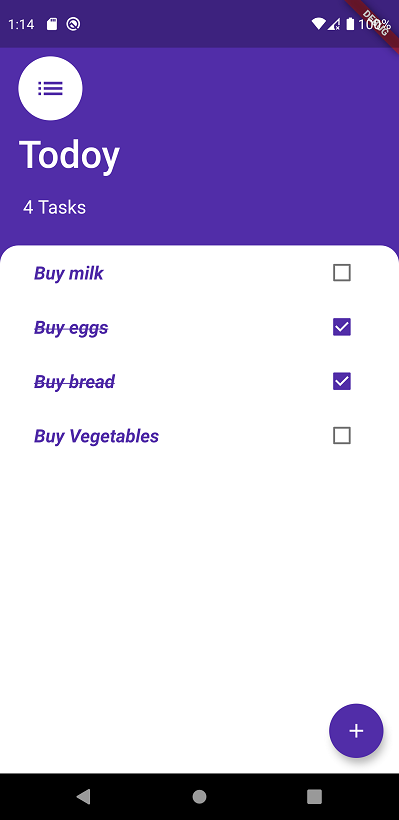
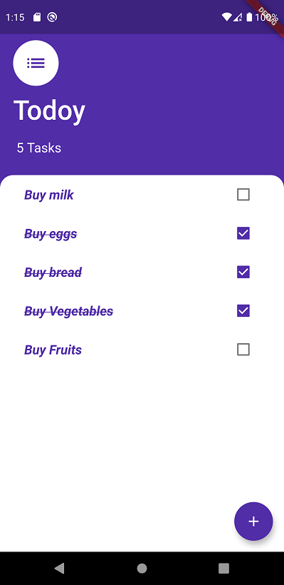

# Todoy ✓

### About

> **A Todo App made with Flutter and Provider package by flutter developers for state management.**

***This app uses Flutter's [Provider Package](https://pub.dev/packages/provider) for simple state management. More Information on package can be found [here](https://flutter.dev/docs/development/data-and-backend/state-mgmt/simple).***

### How to use.
- Use the (+) widget to add a task. 
- Use Checkboxes to set if the task is complete or not.
- Long press the task to delete the task from the list.

### Main functions Used
- [Provider's Package](https://pub.dev/packages/provider)
- [Modal Bottom Sheet](https://pub.dev/packages/modal_bottom_sheet)
- List View Builder

### Usage
***For learning purposes and basic testing and functionality.***

### Screenshots.

                    

                    

                    

